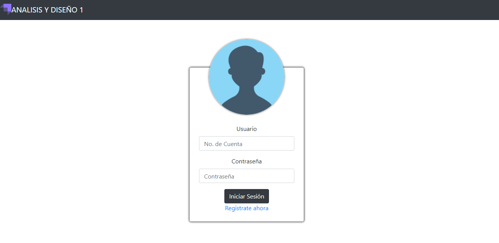
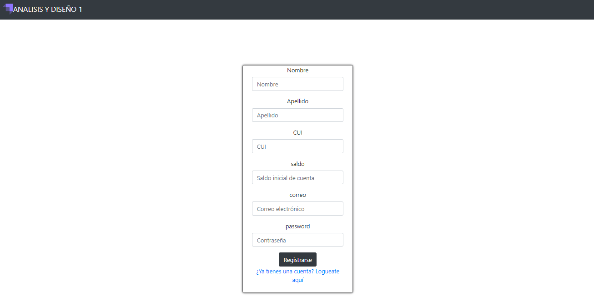
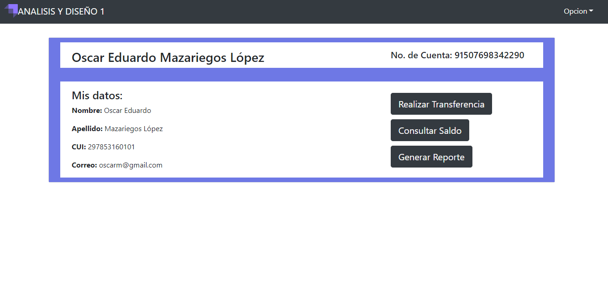
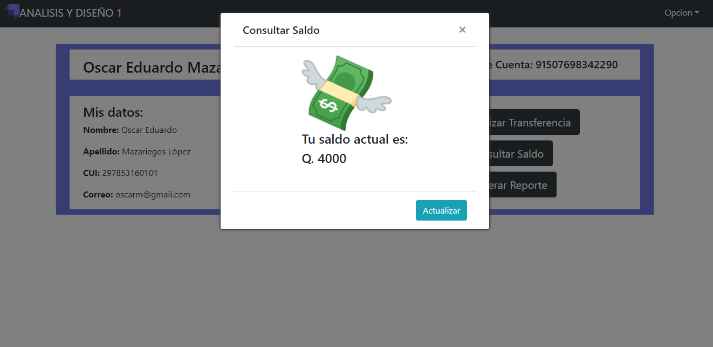
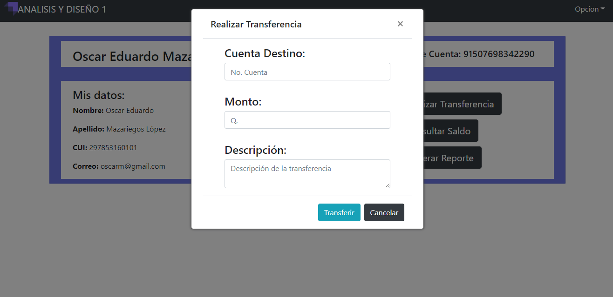

# Práctica 3: Manual de Usuario

## Análisis y Diseño de Sistemas 1

## Grupo 5
---
Integrantes

|Carné | Nombre |
|:----:|:----:|
|201602625| Oscar Alfredo Llamas Lemus|
|201504051| Asunción Mariana Sic Sor|
|201601469| Oscar Eduardo Mazariegos López|
|201612383| Javier Antonio Álvarez González|
|201408549| Elba María Álvarez Domínguez|

## Contenido

### **LOGIN**

### En la pagina de Login se puede iniciar sesión con un usuario que tenga un numero de cuenta previamente registrado.

### *Página inicio de sesión.* ###

### **REGISTRO**

### En la pagina de registro los usuario podran registrase a la aplicación web.

### *Pagina registro.* ###

### **PERFIL**

### En la pagina de Perfil se pueden visualizar los datos del usuario logeado, desde esta pagina se puede acceder a las otras funciones de la aplicación web.

### *Pagina perfil.* ###

### **CONSULTAR SALDO**

### En la pagina de Perfil se podra consultar el saldo actual de la cuenta.

### *Opción de ver saldo.* ###

### **TRANSFERENCIA**

### En la pagina de Perfil se pueden realizar transferencias a otras cuentas que esten registradas a la aplicación web.

### *Opción de transferencia.* ###

### **GENERAR REPORTE**

### En la pagina de Perfil se pueden general reporte con todas las transacciones que se hayan realizado.

### *Opción de generar reporte.* ###
