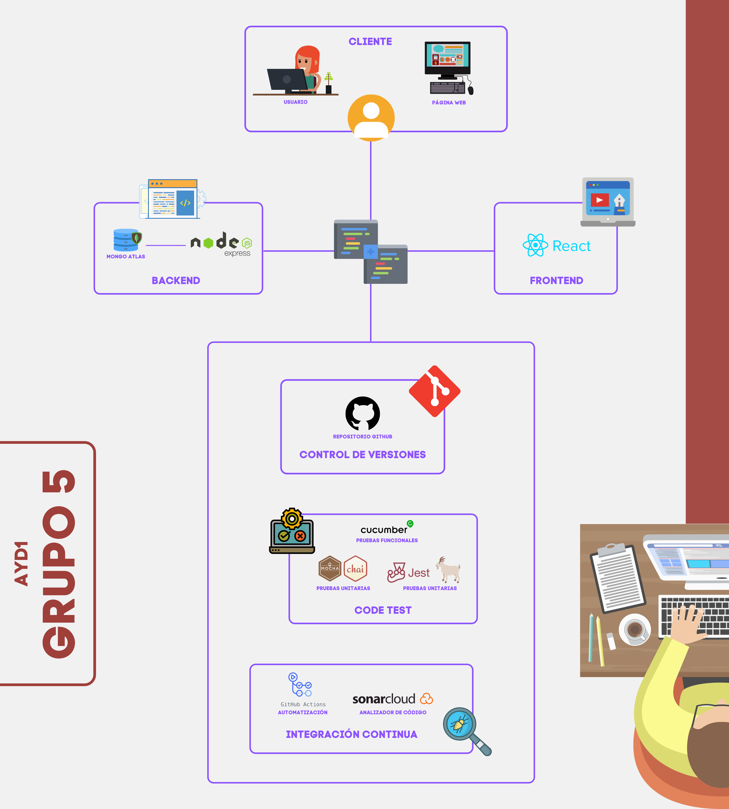
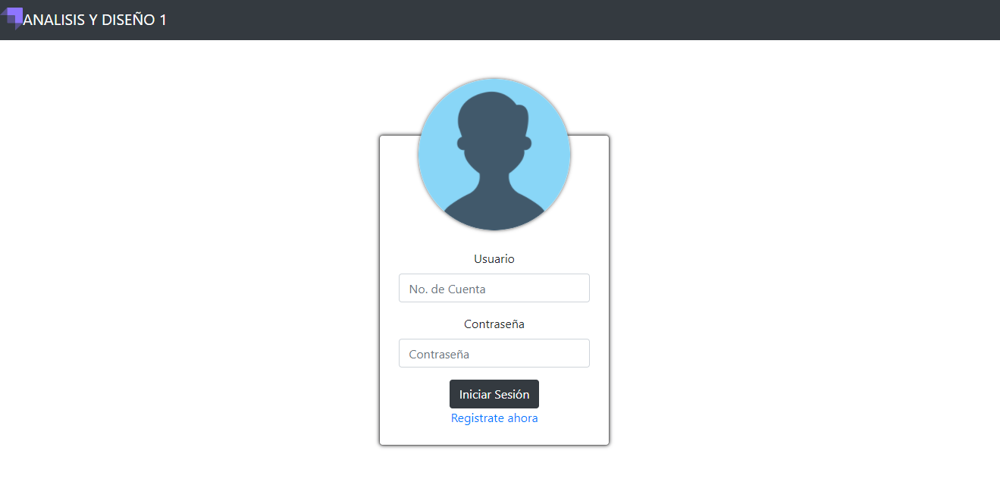
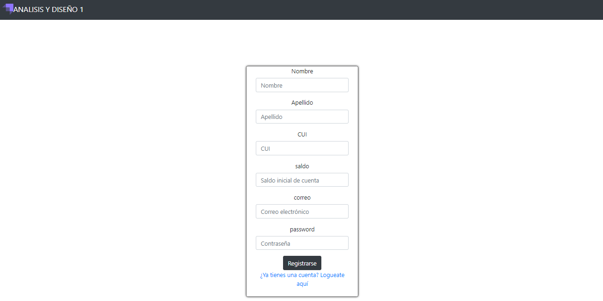
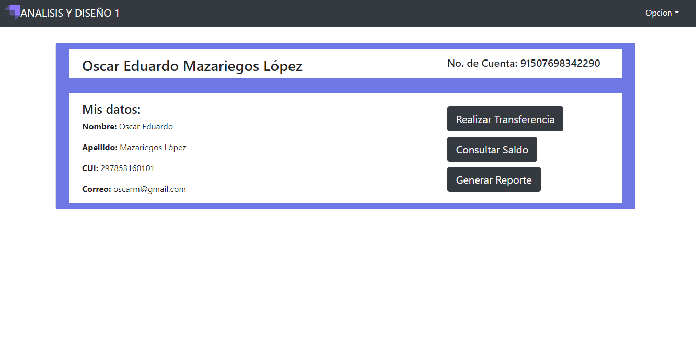
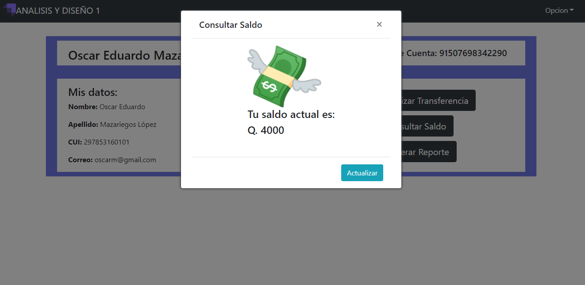
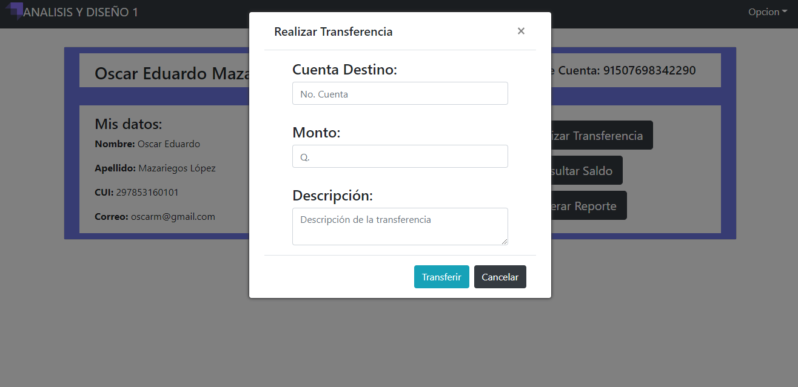
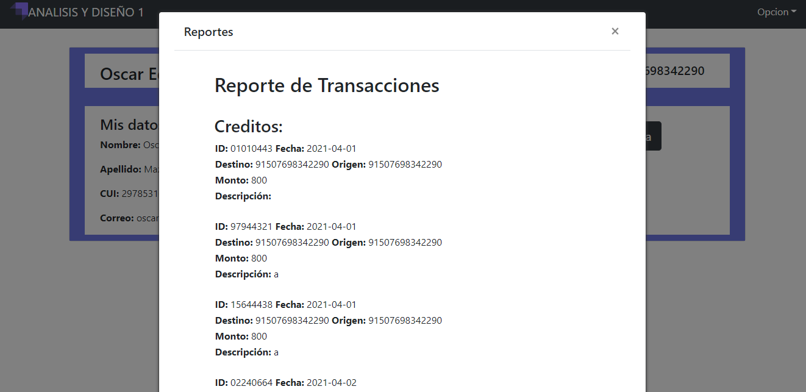

# Práctica 3: Manual Técnico
Análisis y Diseño de Sistemas 1

Grupo 5
---
Integrantes

|Carné | Nombre |
|:----:|:----:|
|201602625| Oscar Alfredo Llamas Lemus|
|201504051| Asunción Mariana Sic Sor|
|201601469| Oscar Eduardo Mazariegos López|
|201612383| Javier Antonio Álvarez González|
|201408549| Elba María Álvarez Domínguez|


## Tabla de Contenido
* [Diagrama de Arquitectura](#diagrama-de-arquitectura)
* [Casos de Prueba](#casos-de-prueba)
    * [BackEnd](#backend)
        * [Pruebas Unitarias](#pruebas-unitarias)
        * [Pruebas Funcionales](#pruebas-funcionales)
    * [FrontEnd](#frontend)
* [Anexos](#anexos)
    * [Capturas de pantalla de la aplicación](#capturas-de-pantalla)

## Diagrama de Arquitectura
En el siguiente diagrama se observa la arquitectura a utilizar para construir el software requerido.



# Casos de Prueba

## **Backend**

### Pruebas Unitarias

<table>
<tr style="text-align:center;">
    <td>Caso de Prueba</td>
    <td>Prueba Unitaria</td>
</tr>
<tr>
<td>¿Qué pasaría si el usuario intenta entrar a la plataforma? <br>
¿Qué pasaría si sus credenciales son correctas? Según el método se esperaría un status 202.</td>
<td>

  ```js
describe('login as a user: ',()=>{
    it('should login', (done) => {
        chai.request(app).post('/login')
        .send({ cuenta: "37747947969500", password: "123456789"})
        .end( function(err,res){
            if (err){
                console.log(err);
            } else {
                console.log(res.body)
                expect(res).to.have.status(202);
                done();
            }
        });
    });
});
  ```
</td>
</tr>
<tr>
<td>¿Qué pasaría si el usuario desea ingresar a la plataforma? <br>
¿Qué pasaría si el usuario provee algún dato erróneo al ingresar a la plataforma? Según el método se esperaría un status 404.</td>
<td>

  ```js
describe('login as a user: ',()=>{
    it(`Shouldn't login`, (done) => {
        chai.request(app)
        .post('/login')
        .send({ cuenta: "37747947969500", password: "123456781"})
        .end( function(err,res){
            if (err){
                console.log(err);
            } else {
                console.log(res.body)
                expect(res).to.have.status(404);
                done();
            }
        });
    });
});
  ```
</td>
</tr>
<tr>
<td style="text-align:center;">
¿Qué pasaría si un usuario que no tiene cuenta desea ingresar a la plataforma?
<br>
¿Qué pasaría si el CUI no pertenece a ningún otro usuario existente? Según el método se esperaría un status 202.
</td>
<td>

  ```js
describe('Register new user: ',()=>{
    it(`Should register a new user`, (done) => {
        chai.request(app)
        .post('/nuevoUsuario')
        .send({
            nombre: "Usuario",
            apellido: "Prueba",
            CUI: "2448618884917871",
            saldo: 175000,
            correo: "usuario@gmail.com",
            password: "123456781"
        })
        .end( function(err,res){
            if (err){
                console.log(err);
            } else {
                console.log(res.body)
                expect(res).to.have.status(202);
                done();
            }
        });
    });
});
  ```
</td>
</tr>
<tr>
<td style="text-align:center;">
¿Qué pasaría si un usuario que no tiene cuenta desea registrarse en la plataforma? <br>
¿Qué pasaría si el CUI con el que desea registrarse ya ha sido utilizado antes? Según el método se esperaría un status 404
</td>
<td>

  ```js
describe('Register new user: ',()=>{
    it(`Shouldn't register a new user`, (done) => {
    chai.request(app)
    .post('/nuevoUsuario')
    .send({
        nombre: "Usuario",
        apellido: "Prueba 2",
        CUI: "3448688500106",
        saldo: 175000,
        correo: "usuario2@gmail.com",
        password: "123456781"
    })
    .end( function(err,res){
        if (err){
            console.log(err);
        } else {
            console.log(res.body)
            expect(res).to.have.status(404);
            done();
        }
    });
    });
});
  ```
</td>
</tr>
<tr>
<td style="text-align:center;">
¿Qué pasaría si se desea obtener la información de cierto usuario?<br>
¿Qué pasaría si el usuario del cual se solicita información existe? Según el método se esperaría un status 202.
</td>
<td>

  ```js
describe('Get profile: ',()=>{
    it('should get profile', (done) => {
    chai.request(app)
    .post('/login')
    .send({ cuenta: "05522194828065", password: "123456789"})
    .end( function(err,res){
        if (err){
            console.log(err);
        } else {
            console.log(res.body)
            expect(res).to.have.status(202);
            done();
        }
    });
    });
});
  ```
</td>
</tr>
<tr>
<td style="text-align:center;">
¿Qué pasaría si se desea obtener información de un usuario en particular? <br>
¿Qué pasaría si el usuario del que se solicitó la información no está registrado en el sistema? Según el método se esperaría un status 404.
</td>
<td>

  ```js
describe('Get profile: ',()=>{
    it(`Shouldn't get profile`, (done) => {
    chai.request(app)
    .post('/login')
    .send({ cuenta: "37747947969500", password: "123456781"})
    .end( function(err,res){
        if (err){
            console.log(err);
        } else {
            console.log(res.body)
            expect(res).to.have.status(404);
            done();
        }
    });
    });
});
  ```
</td>
</tr>
<tr>
<td style="text-align:center;">
¿Qué pasaría si se desea obtener el saldo actual de la base de datos de cierto usuario? <br>
¿Qué pasaría si el CUI enviado sí pertenece a un usuario ya registrado? Según el método se esperaría un status 202.
</td>
<td>

  ```js
describe('Check balance: ',()=>{
    it('Should get user balance', (done) => {
    chai.request(app)
    .post('/consultarSaldo')
    .send({ cuenta: "37747947969500"})
    .end( function(err,res){
        if (err){
            console.log(err);
        } else {
            console.log(res.body)
            expect(res).to.have.status(202);
            done();
        }
    });
    });
});
  ```
</td>
</tr>
<tr>
<td style="text-align:center;">
¿Qué pasaría si se desea obtener el saldo actual de la base de datos de cierto usuario? <br>
¿Qué pasaría si el CUI enviado no pertenece a un usuario ya registrado? Según el método se esperaría un status 404.
</td>
<td>

  ```js
describe('Check balance: ',()=>{
    it(`Shouldn't get user balance`, (done) => {
    chai.request(app)
    .post('/consultarSaldo')
    .send({ cuenta: "3774794796951155"})
    .end( function(err,res){
        if (err){
            console.log(err);
        } else {
            console.log(res.body)
            expect(res).to.have.status(404);
            done();
        }
    });
    });
});
  ```
</td>
</tr>
<tr>
<td style="text-align:center;">
¿Qué pasaría si un usuario desea realizar un nuevo movimiento en su cuenta? <br>
¿Qué pasaría si la cuenta de origen si existe registrada en la base de datos? Según el método se esperaría un status 202. <br>
¿Qué pasaría si la cuenta a la cual se desea abonar si existe registrada en la base de datos? Según el método se esperaría un status 202.
</td>
<td>

  ```js
describe('New transaction: ',()=>{
    it('Should register a new transaction', (done) => {
    chai.request(app)
    .post('/nuevaTransaccion')
    .send({ 
        CuentaOrigen:"37747947969500",
        CuentaDestino:"05522194828065",
        monto: 1000, 
        descripcion: "Transaccion exitosa :D"
    })
    .end( function(err,res){
        if (err){
            console.log(err);
        } else {
            console.log(res.body)
            expect(res).to.have.status(202);
            done();
        }
    });
    });
});
  ```
</td>
</tr>
<tr>
<td style="text-align:center;">
¿Qué pasaría si se desea obtener el saldo actual de la base de datos de cierto usuario? <br>
¿Qué pasaría si la cuenta de origen y/o la de destino no está registrada en la base de datos? Según el método se esperaría un status 404.
</td>
<td>

  ```js
describe('New transaction: ',()=>{
    it(`Shouldn't register a new transaction`, (done) => {
    chai.request(app)
    .post('/nuevaTransaccion')
    .send({ 
        CuentaOrigen:"37747947969500",
        CuentaDestino:"055221948280621",
        monto: 1000
    })
    .end( function(err,res){
        if (err){
            console.log(err);
        } else {
            console.log(res.body)
            expect(res).to.have.status(404);
            done();
        }
    });
    });
});
  ```
</td>
</tr>
<tr>
<td style="text-align:center;">
¿Qué pasaría si se desea obtener el reporte de débitos y créditos de la cuenta de un usuario en particular? <br>
¿Qué pasaría si el CUI enviado como parámetro de un usuario sí está relacionado con una cuenta en la base de datos? Según el método se esperaría un status 202.
</td>
<td>

  ```js
describe('Get transactions report: ',()=>{
    it('Should get user transactions report', (done) => {
    chai.request(app)
    .post('/reporteTransaccion')
    .send({ cuenta: "37747947969500"})
    .end( function(err,res){
        if (err){
            console.log(err);
        } else {
            expect(res).to.have.status(202);
            done();
        }
    });
    });
});
  ```
</td>
</tr>
<tr>
<td style="text-align:center;">
¿Qué pasaría si se desea obtener el reporte de débitos y créditos de la cuenta de un usuario en particular? <br>
¿Qué pasaría si el CUI enviado como parámetro de un usuario no está relacionado con una cuenta en la base de datos? Según el método se esperaría un status 404.
</td>
<td>

  ```js
describe('Get transactions report: ',()=>{
    it(`Shouldn't get user transactions report`, (done) => {
    chai.request(app)
    .post('/reporteTransaccion')
    .send({ cuenta: "37747947969501"})
    .end( function(err,res){
        if (err){
            console.log(err);
        } else {
            expect(res).to.have.status(404);
            done();
        }
    });
    });
});
  ```
</td>
</tr>
<tr>
<td style="text-align:center;">
Este método se encarga de generar la fecha actual y devolver en tipo String. <br>
</td>
<td>

  ```js
describe("testeando generarFecha: ", function() {
    describe("Validando fecha: ", function() {
        it("Check the returned value using: assert.equal(value,'value'): ", 
        function() {
            result   = fecha.generarFecha();
            assert.typeOf(result, 'string');
        });
    });
});
  ```
</td>
</tr>
</table>

### Pruebas Funcionales

<table>
<tr style="text-align:center;">
    <td>Escenario</td>
    <td>Prueba Funcional</td>
</tr>
<tr>
<td>

```feature
Scenario Outline: Como usuario puedo o no ingresar al sistema?
    Given an user with account number: "<account>" and password: "<password>"
    When I send POST request to /login
    Then I get response code: "<status>"

    Examples:
        | account        | password  | status |
        | 37747947969500 | 123456789 | 202    |
        | 37747947969500 | 123456781 | 200    |
```

</td>
<td>

  ```js
Given('an user with account number: {string} and password: {string}', 
    function (account, password) {
        myCredentials = { "cuenta": account, "password": password };
        this.today = JSON.parse(JSON.stringify(myCredentials))
    }
);

When('I send POST request to /login', async function () {
  this.actualAnswer = await restHelper.postData(
      `https://infinite-harbor-77648.herokuapp.com/login`,
      this.today
    );
});

Then('I get response code: {string}', async function (code) {
  assert.equal(String(this.actualAnswer.status), String(code));
});

  ```
</td>
</tr>
<tr>
<td>

```feature
Scenario Outline: como usuario puedo o no consultar mi saldo?
Given an user with account number: "<account>"
When I send POST request to /consultarSaldo
Then I get response code: "<status>"

Examples:
    | account        | status |
    | 37747947969500 | 202    |
    | 37747947969501 | 200    |
```

</td>
<td>

  ```js
Given('an user with account number: {string}', function (account) {
  myCredentials = { "cuenta": account };
  this.today = JSON.parse(JSON.stringify(myCredentials));
});

When('I send POST request to /consultarSaldo', async function () {
  this.actualAnswer = await restHelper.postData(
      `https://infinite-harbor-77648.herokuapp.com/consultarSaldo`, 
      this.today);
});

Then('I get response code: {string}', async function (code) {
  assert.equal(String(this.actualAnswer.status), String(code));
});

  ```
</td>
</tr>
<tr>
<td>

```feature
Scenario Outline: como usuario puedo o no registrarme en el sistema?
Given a new user with credentials: "<name>", "<lastname>", "<CUI>", "<balance>", "mail" and "password"
When I send POST request to /nuevoUsuario
Then I get response code: "<status>"

Examples:
    | name   | lastname | CUI            | balance | mail             | password  | status |
    | prueba | exitosa  | 3441841771168  | 178000  | prueba@gmail.com | 123456789 | 202    |
    | prueba | fallida  | 3448688500106  | 178000  | prueba@gmail.com | 123456789 | 200    |
```

</td>
<td>

  ```js
Given('a new user with credentials: {string}, {string}, {string}, {string}, {string} and {string}', 
    function (name, lastname, CUI, balance, mail, password) {
        myCredentials = { "nombre": String(name),
                        "apellido": String(lastname),
                        "CUI": String(CUI),
                        "saldo": String(balance),
                        "correo": String(mail),
                        "password": String(password) 
                    };
        this.today = JSON.parse(JSON.stringify(myCredentials));
    }
);

When('I send POST request to /nuevoUsuario', async function () {
  this.actualAnswer = await restHelper.postData(
      `https://infinite-harbor-77648.herokuapp.com/nuevoUsuario`, 
      this.today
    );
});

Then('I get response code: {string}', async function (code) {
  assert.equal(String(this.actualAnswer.status), String(code));
});

  ```
</td>
</tr>
<tr>
<td>

```feature
Scenario Outline: Como usuario puedo o no ver mi perfil?
Given an user with account number: "<account>" and password: "<password>"
When I send POST request to /login
Then I get response code: "<status>"

Examples:
    | account        | password  | status |
    | 37747947969500 | 123456789 | 202    |
    | 37747947969500 | 123456781 | 200    |
```

</td>
<td>

  ```js
Given('an user with account number: {string} and password: {string}', 
    function (account, password) {
        myCredentials = { "cuenta": account, "password": password };
        this.today = JSON.parse(JSON.stringify(myCredentials))
    }
);

When('I send POST request to /login', async function () {
  this.actualAnswer = await restHelper.postData(
      `https://infinite-harbor-77648.herokuapp.com/login`, 
      this.today
    );
});

Then('I get response code: {string}', async function (code) {
  assert.equal(String(this.actualAnswer.status), String(code));
});

  ```
</td>
</tr>
<tr>
<td>

```feature
Scenario Outline: Como usuario puedo o no realizar una transaccion?
Given an user with account number: "<account>" who wants to send <number> quetzales 
    to another user with account number: "<account2>"
When I send POST request to /nuevaTransaccion
Then I get response code: "<status>"

Examples:
    | account        | account2       | number | status |
    | 37747947969500 | 05522194828065 | 160    | 202    |
    | 37747947969500 | 05522194821223 | 160    | 202    |
```

</td>
<td>

  ```js
 Given('an user with account number: {string} who wants to send {float} quetzales to another user with account number: {string}', 
    function (account, amount, account2) {
        myCredentials = { "CuentaOrigen": String(account),
                            "CuentaDestino": String(account2),
                            "monto": String(amount), 
                            "descripcion": "BDD exitosa :D"
                        };
        this.today = JSON.parse(JSON.stringify(myCredentials));
    }
);

When('I send POST request to /nuevaTransaccion', async function () {
  this.actualAnswer = await restHelper.postData(
      `https://infinite-harbor-77648.herokuapp.com/nuevaTransaccion`, 
      this.today
    );
});

Then('I get response code: {string}', async function (code) {
  assert.equal(String(this.actualAnswer.status), String(code));
});

  ```
</td>
</tr>
</table>

## **Frontend**
<table>
<tr style="text-align:center;">
    <td>Descripción</td>
    <td>Prueba Unitaria</td>
</tr>
<tr>
<td style="text-align:center;">
Compontes utilizados en las paginas. <br><br>
¿Qué pasaría si el usuario intenta entrar a la pagina?
¿Qué pasaría si todos los componentes utilizados cargan de forma correcta? Se espera que los componentes cargen sin ningun tipo de error.
</td>
<td>

  ```js
describe('Test para los componentes de la aplicación.', ()=>{
    it('Menu se Renderizá sin error', ()=>{
        const wrapper = shallow(<Menu/>);
        expect(wrapper).toHaveLength(1);
    })

    it('Menu Principal se Renderizá sin error', ()=>{
        const wrapper = shallow(<MenuPrincipal/>);
        expect(wrapper).toHaveLength(1);
    })

    it('Formulario Login se Renderizar sin error', ()=>{
        const wrapper = shallow(<FormLogin/>);
        expect(wrapper).toHaveLength(1);
    })

    it('Formulario Registro se Renderizá sin error', ()=>{
        const wrapper = shallow(<FormularioRegistro/>);
        expect(wrapper).toHaveLength(1);
    })

    it('Pdf se Renderizá sin error', ()=>{
        const wrapper = shallow(<PDF/>);
        expect(wrapper).toHaveLength(1);
    })
})

  ```
</td>
</tr>
<tr>
<td style="text-align:center;">
Formularios en la pagina de login y registro. <br><br>
¿Qué pasaría si el usuario intenta acceder a la pagina de login y registro?
¿Qué pasaría si todos los componentes estan centrados en la pagina? Se espera que los componentes de login y registro esten ubicados en el centro.
</td>
<td>

  ```js
describe('Formularios creados correctamente.', ()=>{
    it('Formulario Login debe centrar su contenido.', ()=>{
        expect(shallow(<FormLogin/>).is('.text-center')).toBe(true);
    })

    it('Formulario Registro debe centrar su contenido.', ()=>{
        expect(shallow(<FormularioRegistro/>).is('.text-center')).toBe(true);
    })
})
  ```
</td>
</tr>
<tr>
<td style="text-align:center;">
¿Qué pasaría si el usuario desea ver la menu var? Se espera que el titulo sea el correcto.
</td>
<td>

  ```js
describe('Debe aparecer el titulo de la pagina', ()=>{
    it('Debe tener el titulo analisis', () =>{
        expect(true);
        render(<Menu/>);

        expect(screen.queryByText(/analisis/i)).toBeInTheDocument();
    })
    it('Debe tener el titulo diseño', () =>{
        expect(true);
        render(<Menu/>);

        expect(screen.queryByText(/diseño/i)).toBeInTheDocument();
    })
});
  ```
</td>
</tr>
<tr>
<td style="text-align:center;">
¿Qué pasaría si la pagina de perfil muestra los textos correctamente? Se espera que los datos a mostrar sean pertenecientes al usuario.
</td>
<td>

  ```js
describe('Pagina profile', ()=>{
    it('debe mostrar texto: mis datos', () =>{
        render(<Profile/>)
        // Debe tener label de datos
        expect(screen.queryByText(/mis datos/i)).toBeInTheDocument()
    })

    it('Debe tener boton transferencia', () =>{
        render(<Profile/>)

        expect(
            screen.getByRole(
                'button', 
                {
                    name: /realizar transferencia/i
                }
            )
        ).toBeInTheDocument();
    })

    it('Debe tener boton saldo', () =>{
        render(<Profile/>)

        expect(
            screen.getByRole(
                'button', 
                {
                    name: /saldo/i
                }
            )
        ).toBeInTheDocument();
    })

    it('Debe tener boton reporte', () =>{
        render(<Profile/>)

        expect(
            screen.getByRole(
                'button', 
                {
                    name: /generar reporte/i
                }
            )
        ).toBeInTheDocument();
    })

    it('Debe mostart nombre', () =>{
        let a = render(<Profile/>)
        // /expresion regular/ i -> ignore case 
        expect(screen.queryByText(/nombre/i)).toBeInTheDocument()
    })

    it('Debe mostart apellido', () =>{
        let a = render(<Profile/>)
        // /expresion regular/ i -> ignore case 
        expect(screen.queryByText(/apellido/i)).toBeInTheDocument()
    })

    it('Debe mostart cui', () =>{
        let a = render(<Profile/>)
        // /expresion regular/ i -> ignore case 
        expect(screen.queryByText(/cui/i)).toBeInTheDocument()
    })

    it('Debe mostart correo', () =>{
        let a = render(<Profile/>)
        // /expresion regular/ i -> ignore case 
        expect(screen.queryByText(/correo/i)).toBeInTheDocument()
    })
});
  ```
</td>
</tr>

<tr>
<td style="text-align:center;">
¿Qué pasaría si el componte de registro muestra los labels correctos? Se espera que el label de cada textfield sea el indicado.
</td>
<td>

  ```js
describe('Pagina registro', ()=>{
    it('debe de pedir nombre', () =>{
        render(<Registro/>)
        // Debe tener label de datos
        expect(screen.queryByText(/nombre/i)).toBeInTheDocument()
    })

    it('debe tener textbox de nombre', () =>{
        render(<Registro/>)

        expect(
            screen.getByRole(
                'textbox', 
                { name: /nombre/i }
            )
       ).toBeInTheDocument();
    })

    it('debe de pedir apellido', () =>{
        render(<Registro/>)
        // Debe tener label de datos
        expect(screen.queryByText(/apellido/i)).toBeInTheDocument()
    })

    it('debe tener textbox de apellido', () =>{
        render(<Registro/>)

        expect(
            screen.getByRole(
                'textbox', 
                { name: /nombre/i }
            )
       ).toBeInTheDocument();
    })

    it('debe de pedir cui', () =>{
        render(<Registro/>)
        // Debe tener label de datos
        expect(screen.queryByText(/cui/i)).toBeInTheDocument()
    })

    it('debe tener textbox de cui', () =>{
        render(<Registro/>)

        expect(
            screen.getByRole(
                'spinbutton', 
                { name: /cui/i }
            )
       ).toBeInTheDocument();
    })

    it('debe de pedir saldo', () =>{
        render(<Registro/>)
        // Debe tener label de datos
        expect(screen.queryByText(/saldo/i)).toBeInTheDocument()
    })

    it('debe tener textbox de saldo', () =>{
        render(<Registro/>)

        expect(
            screen.getByRole(
                'spinbutton', 
                { name: /saldo/i }
            )
       ).toBeInTheDocument();
    })

    it('debe de pedir correo', () =>{
        render(<Registro/>)
        // Debe tener label de datos
        expect(screen.queryByText(/correo/i)).toBeInTheDocument()
    })

    it('debe tener textbox de correo', () =>{
        render(<Registro/>)

        expect(
            screen.getByRole(
                'textbox', 
                { name: /correo/i }
            )
       ).toBeInTheDocument();
    })

    it('debe de pedir password', () =>{
        render(<Registro/>)
        // Debe tener label de datos
        expect(screen.queryByText(/password/i)).toBeInTheDocument()
    })

    it('Debe tener boton de registro', () =>{
        render(<Registro/>)

        expect(
            screen.getByRole(
                'button', 
                {
                    name: /registrarse/i
                }
            )
        ).toBeInTheDocument();
    })

});
  ```
</td>
</tr>
<tr>
<td style="text-align:center;">
¿Qué pasaría si el perfil muestra el label "no. de cuenta"? Se espera que el label "no. de cuenta" sea creado correctamente.
</td>
<td>

  ```js
describe('Pagina profile', ()=>{
    it('debe poder publicar', () =>{
        render(<Profile/>)
        // Debe tener label de datos
        expect(screen.queryByText(/no. de cuenta:/i)).toBeInTheDocument()
    })
});
  ```
</td>
</tr>
</table>

## Anexos
### Capturas de pantalla ###

### *Pagina de login* ###


### *Pagina de registro* ###


### *Pagina de perfil* ###


### *Ventana para consultar saldo.* ###


### *Ventana para realizar transferencia.* ###


### *Ventana para generar reporte.* ###



